# 🏥 Healthcare Agent Swarm

> **Intelligent Multi-Agent System for Healthcare Management**
>
> *Powered by LangGraph, Llama 3, and SQLite Cloud*


## 🌟 Overview

The **Healthcare Agent Swarm** is a sophisticated multi-agent AI system designed to streamline patient interactions, appointment scheduling, and medical triage. Built on a micro-agent architecture, it employs specialized agents that collaborate to handle complex user requests in real-time.

The system features a **dynamic frontend visualization** that shows the live state of the agent swarm, highlighting active agents and communication pathways as they process user queries.

## ✨ Key Features

-   **🤖 Multi-Agent Swarm Architecture**:
    -   **Triage Agent**: The entry point. Verifies user identity, assesses needs, and routes to specialists.
    -   **Clinical Agent**: Provides general medical advice and symptom checking (with safety disclaimers).
    -   **Appointment Agent**: Handles scheduling, cancellations, and doctor availability checks.
    -   **Billing Agent**: Manages insurance inquiries and billing questions.

-   **🔐 Secure User Verification**:
    -   Automatic email verification flow for returning patients.
    -   Seamless registration process for new users.

-   **🧠 Intelligent Handoffs**:
    -   Agents autonomously transfer control based on conversation context.
    -   "Smart routing" ensures the right specialist handles the right query.

-   **📊 Real-Time Graph Visualization**:
    -   Interactive React Flow graph showing the agent network.
    -   Live highlighting of the active agent and transition edges during conversation.

-   **☁️ Cloud-Native Database**:
    -   Powered by **SQLite Cloud** for reliable, distributed data storage.
    -   Persists patient records, appointments, and doctor availability.

## 🛠️ Tech Stack

### Backend
-   **Framework**: FastAPI (Python)
-   **Orchestration**: LangGraph, LangChain
-   **LLM**: Meta Llama 3.1 (via Groq)
-   **Database**: SQLite Cloud (SQLAlchemy ORM)
-   **WebSocket**: Real-time bidirectional communication

### Frontend
-   **Framework**: React (Vite)
-   **Styling**: Tailwind CSS
-   **Visualization**: React Flow
-   **Icons**: Lucide React

## 🚀 Getting Started

### Prerequisites
-   Python 3.10+
-   Node.js 18+
-   SQLite Cloud Account & API Key
-   Groq API Key

### 1. Clone the Repository
```bash
git clone https://github.com/yourusername/healthcare-agent-swarm.git
cd healthcare-agent-swarm
```

### 2. Backend Setup
```bash
cd backend
python -m venv venv
# Windows
.\venv\Scripts\activate
# Mac/Linux
source venv/bin/activate

pip install -r requirements.txt
```

Create a `.env` file in `backend/`:
```env
GROQ_API_KEY=your_groq_api_key
SQLITE_CLOUD_API_KEY=your_sqlite_cloud_api_key
```

Initialize the database:
```bash
python init_db.py
```

Start the server:
```bash
uvicorn main:app --reload --port 8000
```

### 3. Frontend Setup
```bash
cd frontend
npm install
npm run dev
```

Visit `http://localhost:5173` to interact with the agent!

## 🏗️ Architecture

```mermaid
graph TD
    User((User)) <--> |WebSocket| API[FastAPI Gateway]
    API <--> Swarm[LangGraph Swarm]
    
    subgraph "Agent Swarm"
        Triage[🏥 Triage Agent]
        Clinical[⚕️ Clinical Agent]
        Appt[📅 Appointment Agent]
        Billing[💰 Billing Agent]
        
        Triage -->|Medical Issue| Clinical
        Triage -->|Booking| Appt
        Triage -->|Payment| Billing
        
        Clinical -->|Need Appt| Appt
        Appt -->|Medical Q| Clinical
        
        Billing -->|Other| Triage
    end
    
    Swarm <--> DB[(SQLite Cloud)]
```



## 📝 Usage Guide

1.  **Start Chat**: Open the application. The Triage Agent will greet you.
2.  **Verification**: Enter your email.
    -   *Existing User*: You'll be welcomed back.
    -   *New User*: You'll be asked to register (Name, Age, Gender).
3.  **Interact**:
    -   *"I have a headache"* -> Routes to **Clinical Agent**.
    -   *"Book an appointment with Dr. Smith"* -> Routes to **Appointment Agent**.
    -   *"Check my bill"* -> Routes to **Billing Agent**.
4.  **Visualize**: Watch the graph on the left to see which agent is currently "thinking" and handling your request.

## 📄 License

This project is licensed under the MIT License - see the [LICENSE](LICENSE) file for details.
