# 🏥 MediConnect AI: The Intelligent Healthcare Swarm

> **Revolutionizing Patient Care with Multi-Agent Orchestration**
>
> *Powered by LangGraph, MoonshotAI Kimi, and Supabase*

[](LICENSE)
[](https://www.python.org/)
[](https://reactjs.org/)
[](https://fastapi.tiangolo.com/)
[](https://supabase.com/)

---

## 🌟 Introduction

**MediConnect AI** represents the next generation of healthcare digital assistants. Unlike traditional chatbots, MediConnect employs a **swarm of specialized AI agents** that collaborate in real-time to solve complex patient needs.

From **triaging symptoms** to **scheduling appointments** and **handling billing inquiries**, our micro-agent architecture ensures that every request is handled by a domain expert. The system features a stunning **live visualization** of the agent network, giving users transparency into the "mind" of the AI as it processes their requests.

## ✨ Key Features

### 🧠 Intelligent Agent Swarm
*   **Triage Agent**: The front-line coordinator that verifies identity and routes requests.
*   **Clinical Agent**: Provides preliminary medical advice and symptom analysis.
*   **Appointment Agent**: Manages doctor schedules and booking logistics.
*   **Billing Agent**: Handles insurance and payment queries with precision.

### 🛡️ Secure & Seamless
*   **Smart Authentication**: Frictionless email verification for returning patients.
*   **Data Privacy**: Built with security-first principles for patient data.

### 👁️ Real-Time Observability
*   **Live Graph Visualization**: Watch the neural pathways of the swarm light up as agents hand off tasks.
*   **Transparent Reasoning**: See exactly which agent is acting and why.

### ⚡ Modern Tech Stack
*   **High Performance**: Built on FastAPI for sub-millisecond latency.
*   **Scalable Database**: Leveraging **Supabase** (PostgreSQL) for real-time, reliable storage.
*   **State-of-the-Art LLM**: Utilizing **MoonshotAI Kimi k2-instruct** (via Groq) for advanced reasoning and context understanding.

## 🏗️ System Architecture

The system is orchestrated using **LangGraph**, creating a directed cyclic graph of agent behaviors.

```mermaid
graph TD
    User((User)) <--> |HTTP/REST| API[FastAPI Gateway]
    API <--> Swarm[LangGraph Swarm]
    
    subgraph "Agent Swarm"
        direction TB
        Triage[🏥 Triage Agent]
        Clinical[⚕️ Clinical Agent]
        Appt[📅 Appointment Agent]
        Billing[💰 Billing Agent]
        
        Triage -->|Medical Issue| Clinical
        Triage -->|Booking| Appt
        Triage -->|Payment| Billing
        
        Clinical -->|Need Appt| Appt
        Appt -->|Medical Q| Clinical
        
        Billing -->|Other| Triage
    end
    
    Swarm <--> DB[(Supabase)]
```



## 🛠️ Technology Stack

| Component | Technology | Description |
|-----------|------------|-------------|
| **Backend** | Python 3.12 | Core logic and orchestration |
| **Framework** | FastAPI | High-performance async web framework |
| **AI Orchestration** | LangGraph | Multi-agent state machine management |
| **LLM** | MoonshotAI Kimi k2-instruct | Powered by Groq for ultra-fast inference |
| **Database** | Supabase (PostgreSQL) | Open source Firebase alternative |
| **Frontend** | React + Vite | Fast, modern UI library |
| **Styling** | Tailwind CSS | Utility-first CSS framework |
| **Visualization** | React Flow | Interactive node-based graph rendering |

## 📂 Project Structure

```bash
├── backend/
│   ├── agents/          # Individual agent logic (Triage, Clinical, etc.)
│   ├── graph/           # LangGraph workflow definitions
│   ├── tools/           # External tools (Search, Database access)
│   ├── models/          # Pydantic models and DB schemas
│   ├── main.py          # FastAPI entry point
│   └── database.py      # Database connection handling
├── frontend/
│   ├── src/
│   │   ├── components/  # React components (Chat, Graph, etc.)
│   │   ├── hooks/       # Custom hooks (WebSocket, etc.)
│   └── ...
└── README.md
```

## 🚀 Getting Started

Follow these steps to get your local healthcare swarm running in minutes.

### Prerequisites
*   **Python 3.10+**
*   **Node.js 18+**
*   **Supabase Account** (for the database)
*   **Groq API Key** (for accessing MoonshotAI models)

### 1. Clone the Repository
```bash
git clone https://github.com/yourusername/healthcare-agent-swarm.git
cd healthcare-agent-swarm
```

### 2. Backend Configuration
Set up the Python environment and dependencies.

```bash
cd backend
python -m venv venv

# Activate Virtual Environment
# Windows:
.\venv\Scripts\activate
# Mac/Linux:
source venv/bin/activate

# Install Dependencies
pip install -r requirements.txt
```

Create a `.env` file in the `backend/` directory with your credentials:
```env
# LLM Provider (Groq)
GROQ_API_KEY=your_groq_api_key

# Database Connection (Supabase/PostgreSQL)
# Note: The application expects these exact lowercase keys
user=your_db_user
password=your_db_password
host=your_db_host
port=5432
dbname=postgres
```

Initialize the database:
```bash
python init_db.py
```

Start the backend server:
```bash
uvicorn main:app --reload --port 8000
```

### 3. Frontend Configuration
Launch the user interface.

```bash
# Open a new terminal
cd frontend

# Install Dependencies
npm install

# Start Development Server
npm run dev
```

🎉 **Success!** Visit `http://localhost:5173` to start chatting with MediConnect.

## 📝 Usage Guide

1.  **Initiate Chat**: Open the app. The **Triage Agent** will welcome you.
2.  **Verify Identity**: Enter your email.
    *   *New Users*: You'll be prompted to register (Name, Age, Gender).
    *   *Returning Users*: Instant verification.
3.  **Explore Scenarios**:
    *   🤒 *Medical Advice*: "I have a sharp pain in my left knee."
    *   📅 *Booking*: "I need to see a cardiologist next Tuesday."
    *   💵 *Billing*: "How much is the consultation fee?"
4.  **Observe**: Watch the **Graph Visualization** on the left to see the agents coordinating your care in real-time.

## 🤝 Contributing

Contributions are welcome! Please feel free to submit a Pull Request.

1.  Fork the Project
2.  Create your Feature Branch (`git checkout -b feature/AmazingFeature`)
3.  Commit your Changes (`git commit -m 'Add some AmazingFeature'`)
4.  Push to the Branch (`git push origin feature/AmazingFeature`)
5.  Open a Pull Request

## 📄 License

Distributed under the MIT License. See `LICENSE` for more information.

---

<p align="center">
  Made with ❤️ by the MediConnect Team
</p>
